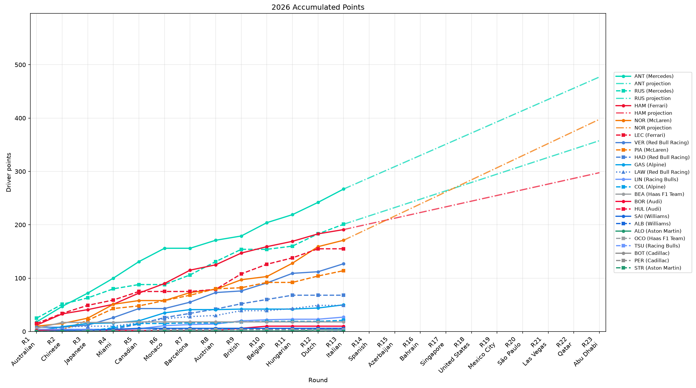
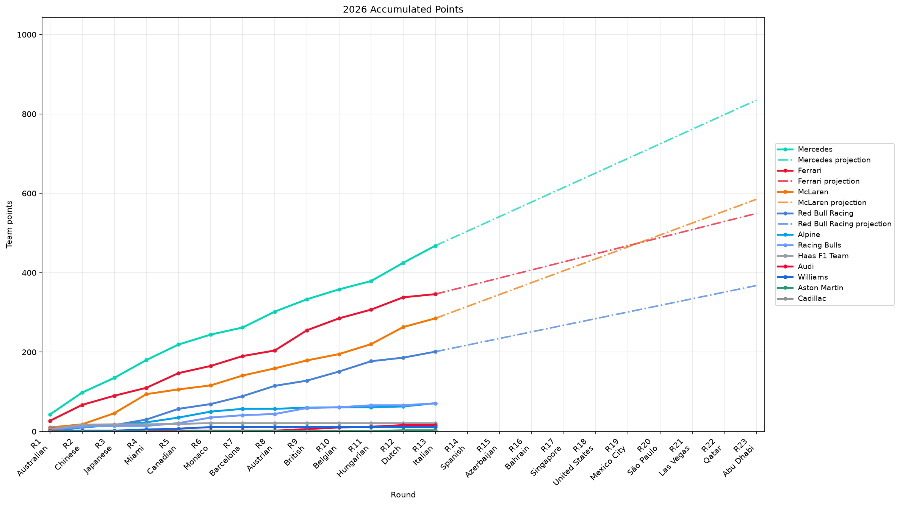

# woStanding

Formula 1 standings analysis and plotting tools built on FastF1.

For future AI-assisted changes, start with
[AI_AGENT_CONTEXT.md](docs/AI_AGENT_CONTEXT.md). It summarizes the repository
purpose, package structure, data contracts, plotting conventions, and
verification expectations.

The package keeps championship-table calculations separate from strategy
analysis. It follows the same lightweight layering used by `woStrategy`:

```text
analysis -> plots -> script
```

- `wostanding.analysis`: dataframe preparation and standings aggregation.
- `wostanding.plots`: matplotlib figure rendering.
- `wostanding.script`: CLI entry points and workflow orchestration.

## Usage

```bash
python -m pip install -e .

python -m wostanding.script.points_progression \
  --year 2026 \
  --race-range '[1, 10]'
```

This writes driver and team progression plots plus CSV exports under `temp/`.
Sprint points are included by default; pass `--exclude-sprints` to use race
points only. Plot output defaults to SVG for crisp vector rendering; pass
`--output-format png` when using the default output path, or pass an explicit
`--output temp/points_progression_2026.png`, to write PNGs instead.

## Examples

Example outputs:

<p>
  
  
</p>
